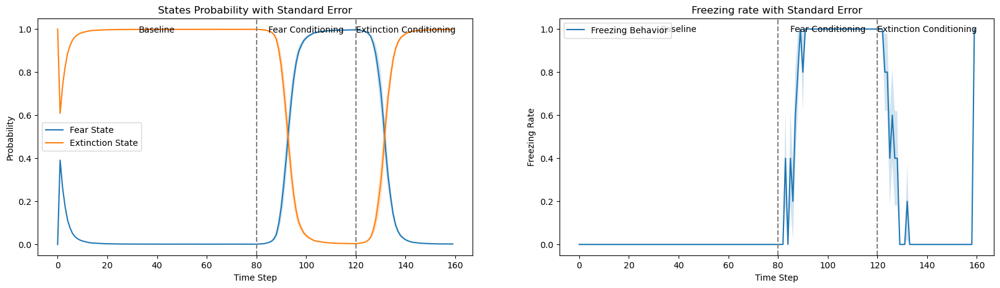

# fear_conditioning

## 1. データ生成プロセス
- 

### overview
- 「観測Oは，状態Sからマルコフモデルによって生成される」とする

### factor（◯の部分）
- S: 状態（fear / extinction）
- O: 観測（shock / no shock）もしくは（sound / no sound）

### parameter（□の部分）
- A: 尤度（状態Sから尤もらしい観測Oにマッピング）
- B: 遷移確率（状態を$S_i$から$S_{i+1}$に遷移させる）
- U: 行動（freezing/not-freezingによって，B確率を変化させる）

## 2. データ生成モデル

### overview
- マウスは観測Oを観測できるが，状態Sは観測できない（隠れ状態）
- 観測Oから状態S（O to S）を推測するためには，データ生成プロセス（S to O）を逆転させる必要がある
- 因子モデルによって，モデルを逆転する（図右下）
- 因子モデルによって，モデルアップデートの規則を明瞭化する（図左）

### model update rule
- $S_{\pi,t}$: t時点で，行動$U$を選んだ時の状態Sの更新規則
- $\pi，G_\pi$: 行動$U$の確率を決める規則（今回は使わない）
- $O_{\pi,t}$: t時点で，行動$U$を選んだ時の状態Oの更新規則

## 3. neural dynamics

### over view
- マルコフモデルの更新規則で用いたメッセージパッシングは，シナプスによるニューラルメッセージパッシングとして理解することもできる（図）
- t時点での状態予測誤差の変数として$\epsilon_{\pi, t}$を導入すると，ニューラルメッセージパッシングの更新規則を得る。
- すなわち，状態予測$v_t$を用いて，
\[\Delta v_t = \epsilon_t = v_t - v_{t-1}\\
S_{\pi,t} = \sigma(v_t)\]
と表すことができる。ただし，ここで$\sigma()$はシグモイド関数。

## 4. Simulation
### overview (GPTよる説明。後日更新します)
- このコードは、恐怖条件付けと消去条件付けのシミュレーションを行うためのものです。
- シミュレーションでは、恐怖状態と消去状態の間の遷移、観測される事象（ショックや音）、および「すくみ行動」といった制御変数の確率的選択をモデル化しています。
- このプロセスは、生成モデルのパラメータを用いて、状態、観測、制御変数の確率を更新することにより行われます。
- シミュレーションタイプ: 3種類のシミュレーションタイプがあり、それぞれ異なるすくみ行動の扱いをしています。
    - タイプ1はショック終了時まですくみ、その後はすくまないというもので、すくみの確率はシグモイド関数に従います。
    - タイプ2はすくみを特に考慮せず、一定の確率で前の状態に留まります。
    - タイプ3はすくみはしないというものです。
- シミュレーションパラメータ: 恐怖条件付けと消去条件付けの時間、ショックの時間、時間ステップの長さなどが設定されています。
- 生成モデル: 状態、観測、制御変数の初期確率を設定し、観測の尤度、状態の遷移確率、初期状態確率、制御変数の好み（ポリシー）を定義しています。
- メッセージパッシング: 状態、観測、制御変数の確率を更新するためのメッセージパッシングアルゴリズムが実装されています。<strong>予測誤差eを勾配降下法を用いて最小化する。</strong>これには、観測の尤度、過去と未来の状態の遷移確率、予測と予測誤差の計算が含まれます。
プロット: シミュレーションの結果として、状態の確率、制御変数（すくみ率）、予測誤差の平均と標準誤差を時間ステップごとにプロットします。

### result

- type 1の結果
- 状態確率（左上），すくみ率（右上），予測誤差信号（下）

- いただいた図

### 参考
Friston, K. J., Parr, T., & de Vries, B. (2017). The graphical brain: Belief propagation and active inference. Network Neuroscience, 1(4), 381–414. https://doi.org/10.1162/NETN_a_00018
